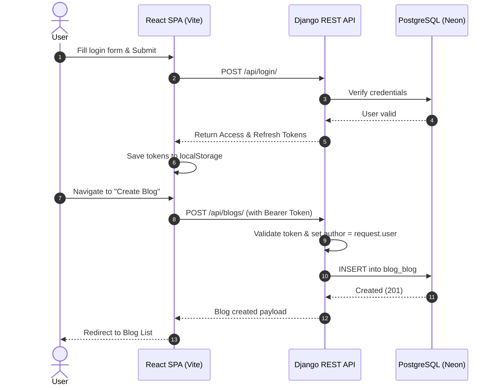

# 📝 BlogApp - Full-Stack Blog Application

[](https://react.dev/)
[](https://vitejs.dev/)
[](https://tailwindcss.com/)
[](https://www.djangoproject.com/)
[](https://www.django-rest-framework.org/)
[](https://neon.tech/)
[](https://jwt.io/)

A modern, production-ready full-stack blogging platform built with **React**, **Django REST Framework (DRF)**, **PostgreSQL (Neon)**, and **JWT Authentication**.

BlogApp enables users to register, log in, create rich blog posts, view all blogs, manage their own publications with strict ownership-based access control, and securely log out with token blacklisting.

---

## 📑 Table of Contents

- [Features](#-features)
- [Tech Stack](#-tech-stack)
- [Project Structure](#-project-structure)
- [Data Models](#-data-models)
- [API Endpoints](#-api-endpoints)
- [Authentication & Authorization](#-authentication--authorization)
- [Application Flow](#-application-flow)
- [Getting Started](#-getting-started)
  - [Prerequisites](#prerequisites)
  - [Backend Setup](#1-backend-setup)
  - [Frontend Setup](#2-frontend-setup)
- [Environment Variables](#-environment-variables)
- [Deployment](#-deployment)
- [API Testing](#-api-testing)
- [Future Improvements](#-future-improvements)
- [Author & License](#-author--license)

---

## 🚀 Features

- **User Authentication**: Secure user registration and login with JWT access and refresh tokens.
- **Token Blacklisting**: Complete logout implementation invalidating refresh tokens on the server.
- **Blog Management (CRUD)**:
  - Create, view, edit, and delete blog posts.
  - Public listing of all published blogs.
  - Dedicated "My Blogs" dashboard for managing author-specific content.
- **Strict Authorization**:
  - Protected API endpoints requiring Bearer tokens.
  - Backend ownership enforcement (users can only edit/delete their own articles).
  - Read-only author assignment (automatically bound to `request.user`).
- **Responsive UI/UX**:
  - Modern developer-focused dark and light aesthetics using Tailwind CSS v4.
  - Form validation with inline error feedback.
  - Protected routes on the frontend preventing unauthenticated access.
- **Production-Ready Architecture**:
  - Hosted cloud PostgreSQL on Neon with SSL connection pooling.
  - CORS security configuration.
  - Single-Page Application (SPA) routing support (`_redirects`).

---

## 🛠️ Tech Stack

### Frontend
- **Framework**: [React 19](https://react.dev/)
- **Build Tool**: [Vite](https://vitejs.dev/)
- **Routing**: [React Router DOM v7](https://reactrouter.com/)
- **Styling**: [Tailwind CSS v4](https://tailwindcss.com/)
- **Icons & Assets**: Custom SVG & modern styling

### Backend
- **Framework**: [Django 5.2](https://www.djangoproject.com/)
- **API Framework**: [Django REST Framework (DRF)](https://www.django-rest-framework.org/)
- **Authentication**: `djangorestframework-simplejwt` (Token Blacklist enabled)
- **CORS Handling**: `django-cors-headers`
- **WSGI / Production Server**: Gunicorn

### Database & Cloud
- **Database**: PostgreSQL (Cloud-hosted on [Neon.tech](https://neon.tech/))
- **Backend Hosting**: [Render](https://render.com/)
- **Frontend Hosting**: [Netlify](https://www.netlify.com/) / Static Hosting

---

## 📁 Project Structure

```text
blogapp/
├── backend/
│   ├── blog/                          # Blog Django Application
│   │   ├── migrations/                # Database migration history
│   │   ├── admin.py                   # Django Admin registration
│   │   ├── apps.py                    # App configuration
│   │   ├── models.py                  # Blog database model
│   │   ├── permissions.py             # Custom IsAuthorOrReadOnly permission
│   │   ├── serializers.py             # DRF User & Blog serializers
│   │   ├── tests.py                   # Unit tests
│   │   ├── urls.py                    # Blog & Auth API routes
│   │   └── views.py                   # API ViewSets & Authentication views
│   ├── config/                        # Django Project Settings
│   │   ├── asgi.py
│   │   ├── settings.py                # Database, CORS, JWT, & App settings
│   │   ├── urls.py                    # Main URL router
│   │   └── wsgi.py                    # WSGI entrypoint for Gunicorn
│   ├── manage.py                      # Django CLI management utility
│   ├── requirements.txt               # Python package dependencies
│   └── .env                           # Backend environment variables
│
├── frontend/
│   ├── public/
│   │   ├── _redirects                 # SPA fallback rules for Netlify / Render
│   │   └── blog.svg                   # Site favicon
│   ├── src/
│   │   ├── components/                # Reusable UI components
│   │   │   ├── Footer.jsx             # Site footer
│   │   │   ├── Navbar.jsx             # Responsive navigation header
│   │   │   └── ProtectedRoute.jsx     # Route guard for authenticated pages
│   │   ├── pages/                     # Application views / pages
│   │   │   ├── BlogList.jsx           # All blogs feed
│   │   │   ├── CreateBlog.jsx         # New blog creation form
│   │   │   ├── EditBlog.jsx           # Blog update & edit form
│   │   │   ├── Home.jsx               # Landing page
│   │   │   ├── LoginPage.jsx          # User login
│   │   │   ├── MyBlogs.jsx            # Authenticated user's blogs
│   │   │   └── RegisterPage.jsx       # User registration
│   │   ├── services/
│   │   │   └── api.js                 # Centralized API fetch handlers
│   │   ├── App.css
│   │   ├── App.jsx                    # Route definitions & layout
│   │   ├── index.css                  # Global Tailwind stylesheet
│   │   └── main.jsx                   # React DOM root entry point
│   ├── dist/                          # Production build output
│   ├── package.json                   # Frontend dependencies & scripts
│   ├── vite.config.js                 # Vite bundler configuration
│   └── .env                           # Frontend environment variables
│
├── .gitignore                         # Git exclusion rules
├── COMMANDS.md                        # Quick command cheat-sheet
└── README.md                          # Project documentation
```

---

## 📝 Data Models

### `Blog` Model (`backend/blog/models.py`)

| Field | Type | Description |
| :--- | :--- | :--- |
| `id` | `BigAutoField` | Primary key |
| `title` | `CharField(max_length=200)` | Title of the blog post |
| `content` | `TextField` | Full content of the blog post |
| `author` | `ForeignKey(User)` | Cascading link to authenticated user |
| `created_date` | `DateTimeField(auto_now_add=True)` | Automatic creation timestamp |
| `updated_date` | `DateTimeField(auto_now=True)` | Automatic update timestamp |

---

## 🔗 API Endpoints

**Base URL**: `http://127.0.0.1:8000/api` (Local) or `https://<your-backend-host>/api` (Production)

### 🔑 Authentication Endpoints

| Method | Endpoint | Access | Description |
| :--- | :--- | :--- | :--- |
| `POST` | `/api/register/` | Public | Register a new user account |
| `POST` | `/api/login/` | Public | Login with credentials and receive JWT pair |
| `POST` | `/api/token/refresh/` | Public | Generate a new access token using refresh token |
| `POST` | `/api/logout/` | Authenticated | Logout and blacklist refresh token |
| `GET` | `/api/profile/` | Authenticated | Retrieve current user profile details |

### 📰 Blog Endpoints

| Method | Endpoint | Access | Description |
| :--- | :--- | :--- | :--- |
| `GET` | `/api/blogs/` | Authenticated | List all published blog posts |
| `POST` | `/api/blogs/` | Authenticated | Create a new blog post |
| `GET` | `/api/blogs/<id>/` | Authenticated | Retrieve details of a specific blog |
| `PUT` | `/api/blogs/<id>/` | Authenticated (Author Only) | Fully update an existing blog |
| `PATCH` | `/api/blogs/<id>/` | Authenticated (Author Only) | Partially update an existing blog |
| `DELETE` | `/api/blogs/<id>/` | Authenticated (Author Only) | Delete an existing blog |

---

## 🔐 Authentication & Authorization

All protected requests require an HTTP `Authorization` header containing the JWT token:

```http
Authorization: Bearer <your_access_token>
```

- **Token Storage**: Stored securely in client storage and attached to requests via centralized service handlers (`frontend/src/services/api.js`).
- **Object-Level Permissions**: Backed by `IsAuthorOrReadOnly` in `backend/blog/permissions.py`. Even if an authenticated user attempts to modify or delete another user's post by ID, the API returns `403 Forbidden`.

---

## 🔄 Application Flow



---

## ⚙️ Getting Started

### Prerequisites
- **Python**: 3.11+
- **Node.js**: 18+ & **npm**
- **Git**

---

### 1. Backend Setup

```powershell
# 1. Navigate to backend directory
cd backend

# 2. Create and activate a Python virtual environment
python -m venv venv

# Windows PowerShell:
venv\Scripts\Activate.ps1
# macOS / Linux:
# source venv/bin/activate

# 3. Install Python dependencies
pip install -r requirements.txt

# 4. Set up environment variables
# Create a .env file (see Environment Variables section below)

# 5. Apply database migrations
python manage.py migrate

# 6. (Optional) Create an admin superuser
python manage.py createsuperuser

# 7. Start the development server
python manage.py runserver
```

Backend will be accessible at: `http://127.0.0.1:8000/`

---

### 2. Frontend Setup

```powershell
# 1. Navigate to frontend directory
cd frontend

# 2. Install dependencies
npm install

# 3. Set up environment variables
# Create a .env file with your API URL:
# VITE_API_BASE_URL="http://127.0.0.1:8000/api"

# 4. Start the Vite development server
npm run dev
```

Frontend will be accessible at: `http://localhost:5173/`

To test the production build locally:
```powershell
npm run build
npm run preview
```

---

## 🌱 Environment Variables

### Backend (`backend/.env`)

```env
SECRET_KEY="your-secure-django-secret-key"
DEBUG=True
DATABASE_URL="postgresql://<user>:<password>@<host>/<dbname>?sslmode=require"
```

### Frontend (`frontend/.env`)

```env
VITE_API_BASE_URL="http://127.0.0.1:8000/api"
# For Production:
# VITE_API_BASE_URL="https://your-backend.onrender.com/api"
```

> **Security Note**: Never commit actual `.env` files with production secrets into version control. Ensure `.env` is listed in your `.gitignore`.

---

## 🚀 Deployment

### Backend (Render / Gunicorn)
- **Runtime**: Python 3
- **Build Command**: `pip install -r requirements.txt && python manage.py migrate`
- **Start Command**: `gunicorn config.wsgi:application`
- **Environment Variables**: Add `SECRET_KEY`, `DEBUG=False`, and `DATABASE_URL`.

### Frontend (Netlify / Static Hosting)
- **Base Directory**: `frontend`
- **Build Command**: `npm run build`
- **Publish Directory**: `frontend/dist`
- **SPA Routing**: Handled automatically via `frontend/public/_redirects` (`/* /index.html 200`).

---

## 🧪 API Testing

The REST APIs can be tested using **Postman**, **curl**, or **Thunder Client**:

- [x] Register user (`POST /api/register/`)
- [x] Login and retrieve tokens (`POST /api/login/`)
- [x] Token refresh verification (`POST /api/token/refresh/`)
- [x] Authenticated profile lookup (`GET /api/profile/`)
- [x] Fetch blog list (`GET /api/blogs/`)
- [x] Create blog with authenticated user (`POST /api/blogs/`)
- [x] Update blog as owner (`PUT /api/blogs/<id>/`)
- [x] Unauthorized update rejection (`403 Forbidden` for non-owners)
- [x] Delete blog as owner (`DELETE /api/blogs/<id>/`)
- [x] Logout & token blacklist verification (`POST /api/logout/`)

---

## 📌 Future Improvements

- [ ] Blog categories, tags, and search filtering
- [ ] Pagination support for blog feeds
- [ ] Cover image uploads with Cloudinary / AWS S3
- [ ] Comment and like system on blog posts
- [ ] Rich-text editor (Markdown or WYSIWYG)
- [ ] Password reset via automated email verification
- [ ] Automated CI/CD pipeline with GitHub Actions

---

## 👨‍💻 Author & License

**Praveen Kumar M**  
Full-Stack Developer | Python • Django • React • PostgreSQL  
GitHub: [@praveen122002](https://github.com/praveen122002)

This project is licensed under the [MIT License](LICENSE) — feel free to use it for learning and demonstration purposes.
