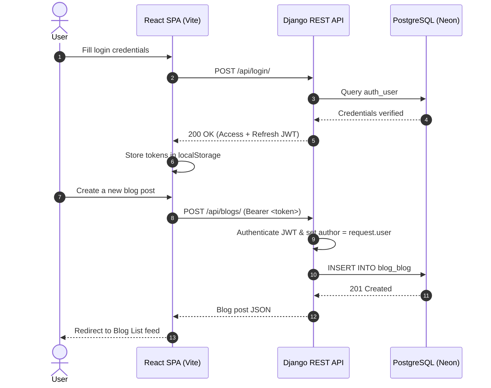

<div align="center">

# 📝 BlogApp

### *A Modern Full-Stack Blog Platform with Django REST Framework & React*

[](https://github.com/praveen122002/BlogApp)
[](https://github.com/praveen122002/BlogApp)
[](LICENSE)

[](https://react.dev/)
[](https://vitejs.dev/)
[](https://tailwindcss.com/)
[](https://www.djangoproject.com/)
[](https://www.django-rest-framework.org/)
[](https://neon.tech/)
[](https://jwt.io/)

[**🌐 Live Demo**](https://kaleidoscopic-tarsier-146c3d.netlify.app) • [**📘 Operations Cheatsheet**](./COMMANDS.md) • [**🐞 Report Bug**](https://github.com/praveen122002/BlogApp/issues) • [**💡 Request Feature**](https://github.com/praveen122002/BlogApp/issues)

</div>

---

## 📖 Table of Contents

- [About The Project](#-about-the-project)
- [Key Features](#-key-features)
- [Tech Stack](#-tech-stack)
- [Repository & File Structure](#-repository--file-structure)
- [Architecture & Application Flow](#-architecture--application-flow)
- [Database Schema](#-database-schema)
- [REST API Reference](#-rest-api-reference)
- [Getting Started](#-getting-started)
  - [Prerequisites](#prerequisites)
  - [Backend Setup](#1-backend-setup)
  - [Frontend Setup](#2-frontend-setup)
- [Environment Variables](#-environment-variables)
- [Deployment](#-deployment)
- [Roadmap & Future Enhancements](#-roadmap--future-enhancements)
- [Contributing](#-contributing)
- [License](#-license)
- [Author & Contact](#-author--contact)

---

## 🌟 About The Project

**BlogApp** is a robust, production-grade full-stack blogging web application. It combines a secure **Django REST Framework** API backend with a dynamic, responsive **React 19 Single Page Application (SPA)**. 

### Core Highlights:
- 🔐 **Stateless JWT Authentication**: Access tokens, refresh tokens, and server-side token blacklisting on logout.
- 🛡️ **Role & Ownership-Based Authorization**: Users can only modify or delete blog posts they authored.
- ⚡ **High Performance & Modern Styling**: Bundled with Vite and styled using Tailwind CSS v4.
- ☁️ **Cloud Database**: Integrated with Neon PostgreSQL serverless pooling.

---

## 🚀 Key Features

| Category | Highlights |
| :--- | :--- |
| **Authentication** | Registration, login with JWT tokens, refresh token rotation, secure logout with blacklisting |
| **Blog Management** | Create posts, view public feed, edit existing articles, delete posts, author dashboard ("My Blogs") |
| **Security** | Password hashing (PBKDF2), object-level permissions, CORS control, JWT expiration |
| **Frontend UX** | Form validation, immediate UI error feedback, protected client routes, responsive mobile-ready layout |
| **Production Ready** | SPA redirect routing (`_redirects`), Gunicorn WSGI server, cloud PostgreSQL |

---

## 🛠️ Tech Stack

### Frontend
- **Framework**: [React 19](https://react.dev/)
- **Bundler / Dev Server**: [Vite](https://vitejs.dev/)
- **Routing**: [React Router DOM v7](https://reactrouter.com/)
- **Styling**: [Tailwind CSS v4](https://tailwindcss.com/)

### Backend
- **Framework**: [Django 5.2](https://www.djangoproject.com/)
- **REST Framework**: [Django REST Framework (DRF)](https://www.django-rest-framework.org/)
- **Authentication**: `djangorestframework-simplejwt`
- **CORS Handling**: `django-cors-headers`
- **WSGI Server**: [Gunicorn](https://gunicorn.org/)

### Database & Infrastructure
- **Database**: [PostgreSQL (Neon Serverless)](https://neon.tech/)
- **Backend Hosting**: [Render](https://render.com/)
- **Frontend Hosting**: [Netlify](https://www.netlify.com/)

---

## 📁 Repository & File Structure

### GitHub Quick Navigation

| Directory / File | Description |
| :--- | :--- |
| 📂 [**`backend/`**](./backend/) | Django 5 project root with REST API, models, and configuration |
| ├── 📁 [**`blog/`**](./backend/blog/) | Core blog application (models, views, permissions, serializers, URLs) |
| ├── 📁 [**`config/`**](./backend/config/) | Project settings, URL routing, ASGI/WSGI entry points |
| ├── 📄 [**`manage.py`**](./backend/manage.py) | Django command-line execution script |
| └── 📄 [**`requirements.txt`**](./backend/requirements.txt) | Python dependencies list |
| 📂 [**`frontend/`**](./frontend/) | React 19 SPA project root powered by Vite & Tailwind CSS |
| ├── 📁 [**`public/`**](./frontend/public/) | Static assets and [`_redirects`](./frontend/public/_redirects) for SPA routing |
| └── 📁 [**`src/`**](./frontend/src/) | Source code |
| &nbsp;&nbsp;&nbsp;&nbsp;├── 📁 [**`components/`**](./frontend/src/components/) | Reusable UI components ([`Navbar`](./frontend/src/components/Navbar.jsx), [`Footer`](./frontend/src/components/Footer.jsx), [`ProtectedRoute`](./frontend/src/components/ProtectedRoute.jsx)) |
| &nbsp;&nbsp;&nbsp;&nbsp;├── 📁 [**`pages/`**](./frontend/src/pages/) | Application views ([`Home`](./frontend/src/pages/Home.jsx), [`BlogList`](./frontend/src/pages/BlogList.jsx), [`CreateBlog`](./frontend/src/pages/CreateBlog.jsx), [`EditBlog`](./frontend/src/pages/EditBlog.jsx), [`LoginPage`](./frontend/src/pages/LoginPage.jsx), [`RegisterPage`](./frontend/src/pages/RegisterPage.jsx), [`MyBlogs`](./frontend/src/pages/MyBlogs.jsx)) |
| &nbsp;&nbsp;&nbsp;&nbsp;└── 📁 [**`services/`**](./frontend/src/services/) | Centralized API service layer ([`api.js`](./frontend/src/services/api.js)) |
| 📄 [**`COMMANDS.md`**](./COMMANDS.md) | Operations cheat-sheet for running and managing the app |
| 📄 [**`README.md`**](./README.md) | Main repository documentation |

<details>
<summary><b>Click to expand full ASCII directory tree</b></summary>

```text
blogapp/
├── backend/
│   ├── blog/
│   │   ├── migrations/
│   │   ├── admin.py
│   │   ├── apps.py
│   │   ├── models.py
│   │   ├── permissions.py
│   │   ├── serializers.py
│   │   ├── tests.py
│   │   ├── urls.py
│   │   └── views.py
│   ├── config/
│   │   ├── asgi.py
│   │   ├── settings.py
│   │   ├── urls.py
│   │   └── wsgi.py
│   ├── manage.py
│   ├── requirements.txt
│   └── .env
├── frontend/
│   ├── public/
│   │   ├── _redirects
│   │   └── blog.svg
│   ├── src/
│   │   ├── components/
│   │   │   ├── Footer.jsx
│   │   │   ├── Navbar.jsx
│   │   │   └── ProtectedRoute.jsx
│   │   ├── pages/
│   │   │   ├── BlogList.jsx
│   │   │   ├── CreateBlog.jsx
│   │   │   ├── EditBlog.jsx
│   │   │   ├── Home.jsx
│   │   │   ├── LoginPage.jsx
│   │   │   ├── MyBlogs.jsx
│   │   │   └── RegisterPage.jsx
│   │   ├── services/
│   │   │   └── api.js
│   │   ├── App.css
│   │   ├── App.jsx
│   │   ├── index.css
│   │   └── main.jsx
│   ├── dist/
│   ├── package.json
│   ├── vite.config.js
│   └── .env
├── .gitignore
├── COMMANDS.md
└── README.md
```
</details>

---

## 🔄 Architecture & Application Flow



---

## 📝 Database Schema

### `Blog` Model (`backend/blog/models.py`)

| Column | Type | Constraints | Description |
| :--- | :--- | :--- | :--- |
| `id` | `BigAutoField` | `PRIMARY KEY` | Auto-incrementing identifier |
| `title` | `CharField(200)` | `NOT NULL` | Title of the blog post |
| `content` | `TextField` | `NOT NULL` | Body content of the blog post |
| `author` | `ForeignKey(User)` | `CASCADE` | Link to the author (`auth_user`) |
| `created_date` | `DateTimeField` | `auto_now_add=True` | Timestamp when published |
| `updated_date` | `DateTimeField` | `auto_now=True` | Timestamp of last modification |

---

## 🔗 REST API Reference

**Base URL**: `http://127.0.0.1:8000/api` (Local) | `https://blogapp-4syg.onrender.com/api` (Production)

### 🔑 Authentication Endpoints

| Method | Endpoint | Authorization | Description |
| :---: | :--- | :---: | :--- |
| `POST` | `/register/` | None | Register a new user account |
| `POST` | `/login/` | None | Authenticate and obtain JWT access & refresh tokens |
| `POST` | `/token/refresh/` | None | Refresh an expired access token |
| `POST` | `/logout/` | `Bearer <token>` | Blacklist refresh token and logout |
| `GET` | `/profile/` | `Bearer <token>` | Retrieve current authenticated user profile |

### 📰 Blog Endpoints

| Method | Endpoint | Authorization | Description |
| :---: | :--- | :---: | :--- |
| `GET` | `/blogs/` | `Bearer <token>` | List all published blog posts |
| `POST` | `/blogs/` | `Bearer <token>` | Create a new blog post |
| `GET` | `/blogs/<id>/` | `Bearer <token>` | Retrieve details of a specific blog post |
| `PUT` | `/blogs/<id>/` | `Bearer <token>` (Author Only) | Fully update a blog post |
| `PATCH` | `/blogs/<id>/` | `Bearer <token>` (Author Only) | Partially update a blog post |
| `DELETE` | `/blogs/<id>/` | `Bearer <token>` (Author Only) | Delete a blog post |

---

## ⚙️ Getting Started

### Prerequisites
- [Python 3.11+](https://www.python.org/)
- [Node.js 18+](https://nodejs.org/) & `npm`
- [Git](https://git-scm.com/)

---

### 1. Backend Setup

```bash
# Clone the repository
git clone https://github.com/praveen122002/BlogApp.git
cd BlogApp/backend

# Create and activate virtual environment
python -m venv venv

# Windows (PowerShell):
venv\Scripts\Activate.ps1
# macOS / Linux:
# source venv/bin/activate

# Install dependencies
pip install -r requirements.txt

# Run migrations
python manage.py migrate

# (Optional) Create superuser admin
python manage.py createsuperuser

# Start development server
python manage.py runserver
```
Backend will start on: **`http://127.0.0.1:8000/`**

---

### 2. Frontend Setup

```bash
# Navigate to frontend
cd ../frontend

# Install node dependencies
npm install

# Start development server
npm run dev
```
Frontend will start on: **`http://localhost:5173/`**

---

## 🌱 Environment Variables

### Backend (`backend/.env`)

```env
SECRET_KEY="your-secret-key"
DEBUG=True
DATABASE_URL="postgresql://<user>:<password>@<host>/<dbname>?sslmode=require"
```

### Frontend (`frontend/.env`)

```env
# Local Development
VITE_API_BASE_URL="http://127.0.0.1:8000/api"

# Production
# VITE_API_BASE_URL="https://blogapp-4syg.onrender.com/api"
```

---

## 🚀 Deployment

- **Backend ([Render](https://render.com/))**:
  - Build Command: `pip install -r requirements.txt && python manage.py migrate`
  - Start Command: `gunicorn config.wsgi:application`
- **Frontend ([Netlify](https://www.netlify.com/))**:
  - Base Directory: `frontend`
  - Build Command: `npm run build`
  - Publish Directory: `frontend/dist`
  - SPA Routing: Handled by [`public/_redirects`](./frontend/public/_redirects)

---

## 📌 Roadmap & Future Enhancements

- [ ] Category & Tag filtering for articles
- [ ] Search query support with debounced inputs
- [ ] Cover image uploads with Cloudinary
- [ ] Comments & like reactions
- [ ] Rich-Text Markdown WYSIWYG editor
- [ ] Password reset via automated email verification
- [ ] Automated CI/CD pipeline with GitHub Actions

---

## 🤝 Contributing

Contributions are welcome! Please follow these steps:

1. Fork the Project (`https://github.com/praveen122002/BlogApp/fork`)
2. Create your Feature Branch (`git checkout -b feature/AmazingFeature`)
3. Commit your Changes (`git commit -m 'feat: Add some AmazingFeature'`)
4. Push to the Branch (`git push origin feature/AmazingFeature`)
5. Open a Pull Request

---

## 📄 License

Distributed under the **MIT License**. See [`LICENSE`](LICENSE) for more details.

---

## 👨‍💻 Author & Contact

**Praveen Kumar M**  
Full-Stack Developer | Python • Django • React • PostgreSQL  
- **GitHub**: [@praveen122002](https://github.com/praveen122002)
- **Project Link**: [https://github.com/praveen122002/BlogApp](https://github.com/praveen122002/BlogApp)
